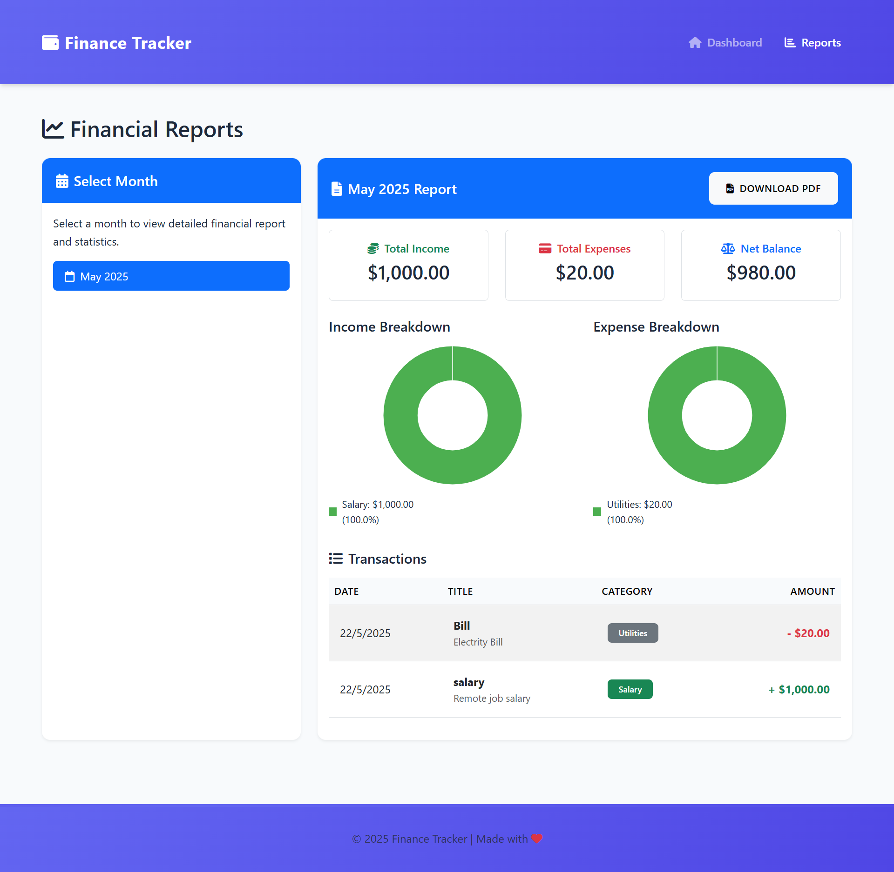

# 💰 Finance Tracker

A comprehensive personal finance management application built with Node.js, Express, and EJS templates. Track your income, expenses, and get detailed financial reports with beautiful visualizations.

## 🌟 Features

### 📊 Dashboard Overview
- **Real-time Financial Summary**: View total income, expenses, and net balance at a glance
- **Quick Transaction Entry**: Add new transactions directly from the dashboard
- **Recent Transactions**: See your latest financial activities with edit/delete options
- **Search Functionality**: Find specific transactions quickly

### 📈 Detailed Reports
- **Monthly Financial Reports**: Generate comprehensive reports for any selected month
- **Visual Analytics**: Interactive pie charts showing income and expense breakdowns
- **PDF Export**: Download your financial reports as PDF documents
- **Category-wise Analysis**: Understand your spending patterns by category

### 💳 Transaction Management
- **Dual Transaction Types**: Support for both income and expense tracking
- **Smart Categorization**: Organize transactions with predefined categories (Salary, Utilities, etc.)
- **Flexible Data Entry**: Add titles, amounts, categories, and optional descriptions
- **Edit & Delete**: Full CRUD operations for all transactions

### 🎨 User Experience
- **Modern UI Design**: Clean, intuitive interface with purple gradient theme
- **Responsive Layout**: Works seamlessly on desktop and mobile devices
- **Real-time Updates**: Instant calculation of balances and totals
- **Professional Styling**: Consistent design language throughout the application

## 🛠️ Tech Stack

- **Backend**: Node.js, Express.js
- **Frontend**: EJS Templates, HTML5, CSS3, JavaScript
- **Database**: [Your database choice - MongoDB/MySQL/SQLite]
- **Charts**: Chart.js for data visualization
- **Styling**: Custom CSS with modern design principles

## 📁 Project Structure

```
finance-tracker/
├── 📁 public/
│   ├── 📁 css/
│   │   └── style.css
│   ├── 📁 js/
│   │   └── main.js
│   └── 📁 images/
├── 📁 views/
│   ├── 📁 partials/
│   │   ├── header.ejs
│   │   └── footer.ejs
│   ├── dashboard.ejs
│   ├── reports.ejs
│   └── layout.ejs
├── 📁 routes/
│   ├── index.js
│   ├── transactions.js
│   └── reports.js
├── 📁 models/
│   └── transaction.js
├── 📁 controllers/
│   ├── dashboardController.js
│   ├── transactionController.js
│   └── reportController.js
├── 📁 config/
│   └── database.js
├── app.js
├── package.json
├── package-lock.json
└── README.md
```

## 🚀 Quick Start

### Prerequisites
- Node.js (v14 or higher)
- npm or yarn package manager
- [Database software if applicable]

### Installation

1. **Clone the repository**
   ```bash
   git clone https://github.com/yourusername/finance-tracker.git
   cd finance-tracker
   ```

2. **Install dependencies**
   ```bash
   npm install
   ```

3. **Set up environment variables**
   ```bash
   cp .env.example .env
   # Edit .env with your configuration
   ```

4. **Initialize database**
   ```bash
   npm run setup-db
   ```

5. **Start the application**
   ```bash
   npm start
   ```

6. **Visit the application**
   Open your browser and go to `http://localhost:3000`

## 📱 Screenshots

### Dashboard View
![Dashboard](screenshots/dashboard.png
*Main dashboard showing financial overview and quick transaction entry*

### Reports Page

*Detailed monthly reports with visual analytics and PDF export*

## 🔧 Configuration

### Environment Variables
```env
PORT=3000
DB_CONNECTION_STRING=your_database_url
SESSION_SECRET=your_session_secret
NODE_ENV=development
```

### Database Setup
[Include specific instructions for your database setup]

## 📊 API Endpoints

| Method | Endpoint | Description |
|--------|----------|-------------|
| GET | `/` | Dashboard page |
| GET | `/reports` | Reports page |
| POST | `/transactions` | Add new transaction |
| PUT | `/transactions/:id` | Update transaction |
| DELETE | `/transactions/:id` | Delete transaction |
| GET | `/api/reports/:month` | Get monthly report data |

## 🧪 Testing

```bash
# Run all tests
npm test

# Run with coverage
npm run test:coverage

# Run in watch mode
npm run test:watch
```

## 🚀 Deployment

### Using Heroku
```bash
# Login to Heroku
heroku login

# Create new app
heroku create your-finance-tracker

# Set environment variables
heroku config:set NODE_ENV=production

# Deploy
git push heroku main
```

### Using Docker
```bash
# Build image
docker build -t finance-tracker .

# Run container
docker run -p 3000:3000 finance-tracker
```

## 🤝 Contributing

We welcome contributions! Please follow these steps:

1. Fork the repository
2. Create a feature branch (`git checkout -b feature/amazing-feature`)
3. Commit your changes (`git commit -m 'Add amazing feature'`)
4. Push to the branch (`git push origin feature/amazing-feature`)
5. Open a Pull Request

### Development Guidelines
- Follow the existing code style
- Write meaningful commit messages
- Add tests for new features
- Update documentation as needed

## 📝 License

This project is licensed under the MIT License - see the [LICENSE](LICENSE) file for details.

## 👨‍💻 Author

**[Your Name]**
- GitHub: [@yourusername](https://github.com/Anas-Yousaf)
- LinkedIn: [Your LinkedIn](https://linkedin.com/in/anas-yousaf-96880932b)
- Email: anasyousaf66@gmail.com

## 🙏 Acknowledgments

- Thanks to the Node.js and Express.js communities
- Chart.js for beautiful data visualizations
- All contributors who helped improve this project

## 📈 Future Enhancements

- [ ] Multi-user support with authentication
- [ ] Budget planning and alerts
- [ ] Recurring transaction automation
- [ ] Data export to Excel/CSV
- [ ] Mobile app development
- [ ] Integration with banking APIs
- [ ] Advanced analytics and forecasting

## 🐛 Known Issues

- [List any known issues or limitations]
- [Link to issue tracker if applicable]

## 📞 Support

If you encounter any issues or have questions:
- Open an issue on GitHub
- Check the [FAQ section](FAQ.md)
- Contact the maintainer

---

⭐ **Star this repository if you found it helpful!**

*Made with ❤️ by Anas Yousaf
